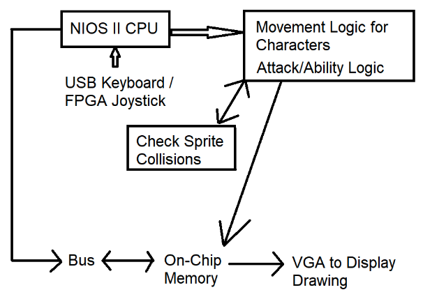

ECE385 Final Project - Street Fighter II
============================================

WARNING
-------

You **SHOULD NOT** copy these code into your own ECE 385 project without proper citation. Doing this is a violation of academic integrity. **You have been warned.**

I do not own the copyright to artworks in this project. They are downloaded from websites that provide these artworks for free.

Overview
--------

This is the final project for my ECE 385 course at UIUC.
The project consists of circuitry on a MAX10-DE10 Lite FPGA and softwares running on NIOS-II soft processor.

A more detailed pdf writeup is included in this repository.

Features
--------

- Displays colored output on the VGA monitor.
- The USB keyboard controls character movement and attacks.
- Characters take damage and interact with one another.
- Healthbar keeps track of Character health.
    - Game keeps track of rounds won by each character.
    - Game ends and declares a winner after a certain number of rounds.
- USB support
  - Separate NIOS-II processor for USB processing
    - Communicate with main processor via dual-port on chip memory
    - Allow separate reset (to workaround buggy keyboards)
- Sprite animations and alternating background maps

Project Architecture
-------
 

